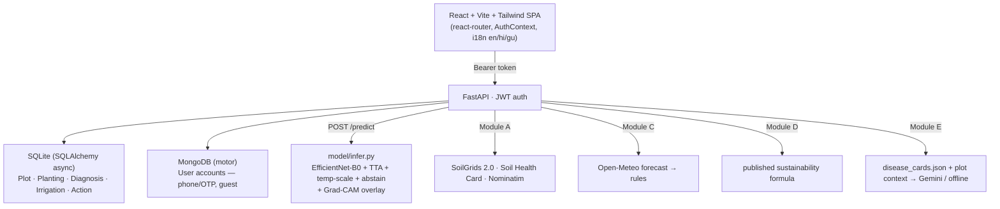

[](#-whats-actually-built)
[](#-tests)
[](#-how-well-the-classifier-holds-up)
[](#-tech-stack)
[](#-data-sources--licences)

**A farm app that answers the three questions a farmer actually asks:**
*What's wrong with this leaf? What should I do about my soil? What does the weather mean for tomorrow?*

> SIH 2026 internal hackathon — L. J. Institute · PS‑1 / C‑433

AgriSmart AI logs a farmer in, remembers their plots, and answers all three — grounded in real soil data, a real forecast, and a disease model that admits when it isn't sure.

---

## 🚶 The flow


```
                          │
                          ├──▶ 🧪 Plot detail — soil profile · crop fit · amendments · activity timeline
                          ├──▶ ☀️ Weather advice — rules over Open‑Meteo
                          ├──▶ ♻️ Sustainability score — published formula
                          └──▶ 💬 Farm assistant — voice, grounded RAG, en / hi / gu
```

---

## 🧩 What's actually built


| # | Module | What it does | Where |
|---|--------|---------------|-------|
| **Core** | Crop‑disease detection | Photo of a leaf in, disease label out — with a Grad‑CAM overlay showing where the model looked, and abstention when confidence is too low to trust | `model/`, `POST /predict` |
| **A** | Crop recommendation | Re‑imagined as **GPS → real soil**: SoilGrids 2.0 + Soil Health Card resolve texture, pH, N‑P‑K for the exact plot → crop fit + amendments | `services/soil_*`, `routers/{soil,recommend}.py` |
| **C** | Weather intelligence | A 3‑day Open‑Meteo forecast runs through a rule engine and comes out the other side as something a farmer can act on today | `services/weather.py`, `POST /weather/advice` |
| **D** | Sustainability score | A reproducible, **published** formula scores each plot's practices and returns concrete tips — no black box | `services/sustainability.py`, `POST /sustainability/score` |
| **E** | GenAI farm assistant | Grounded RAG over a disease‑card corpus + live plot context. Gemini when a key is set, offline knowledge‑base otherwise. Voice in/out, en/hi/gu | `services/assistant.py`, `POST /assistant/ask` |
| **F/G** | IoT / agentic advisor | ✂️ Scoped and planned, deliberately left out to keep the shipped modules solid | — |

---

## 📊 How well the classifier holds up


**timm EfficientNet‑B0**, fine‑tuned with field‑simulation augmentation, temperature scaling, test‑time augmentation, and low‑confidence abstention — because a wrong diagnosis with high confidence is worse than an honest "not sure."

| Metric | Score | Notes |
|--------|:-----:|-------|
| Macro‑F1 (15% held‑out val) | **0.966** | lab‑condition images, same distribution as training |
| Accuracy (15% held‑out val) | **0.967** | " |
| Macro‑F1 (`evaluate.py`, ≤35/class) | **0.992** | sanity check via the predict interface; overlaps training data |
| Disease classes | **18** | PlantVillage subset |

> ⚠️ **These are lab‑image numbers.** The real test is lab‑to‑field generalisation — the augmentation and abstention target exactly that gap. Retrain against the organisers' held‑out field set when it ships; only the class folder names change.

Full per‑class precision/recall + confusion matrix: [`report/model_report.md`](report/model_report.md).

---

## 🗄️ Where the data lives

The plan called for **MongoDB**. This build keeps that promise where it matters — accounts — and picks the simplest honest option everywhere else.

| | MongoDB — accounts | SQLite — farm data |
|---|---|---|
| **Holds** | phone/OTP login, name, location, primary crop | plots, plantings, diagnoses, irrigation, actions |
| **Why** | matches the original plan exactly; visible in MongoDB Compass | one file, zero setup — runs anywhere with no infra |
| **Built with** | hand‑rolled `motor` repo, not a full ODM (same "a handful of functions is enough" reasoning as JWT auth) | SQLAlchemy 2, async |
| **Location** | `app/backend/models/user.py`, `services/users.py` | `app/backend/models/orm.py` |
| **Tested via** | in‑memory `mongomock-motor` — no real server needed | in‑process test DB |

The schema in `orm.py` is a portable superset of the plan's original data model.

---

## 🏗️ Architecture



All API routes live under `/api` (the SPA keeps bare paths like `/weather`, `/soil` for itself). Uploaded images and Grad‑CAM overlays serve from `/uploads`.

<details>
<summary><strong>API reference</strong> — click to expand the full endpoint table</summary>

| Method | Endpoint | Auth | Purpose |
|--------|----------|:----:|---------|
| `POST` | `/api/auth/otp/request`, `/api/auth/otp/verify`, `/api/auth/guest`, `/api/auth/complete-profile` | – | accounts: phone+OTP, guest, onboarding |
| `GET` | `/api/auth/me` | ✅ | current account |
| `GET/POST/PATCH/DELETE` | `/api/plots`, `/api/plots/{id}` | ✅ | fields; create auto‑fetches soil |
| `GET` | `/api/plots/{id}/timeline` | ✅ | merged diagnoses + irrigation + actions |
| `POST` | `/api/plantings`, `/api/irrigation`, `/api/actions` | ✅ | crop + activity logs |
| `POST` | `/api/predict` (multipart image) | ✅ | disease diagnosis + Grad‑CAM, writes history |
| `GET` | `/api/diagnoses` | ✅ | scan history |
| `POST` | `/api/soil/lookup`, `/api/recommend/amendments`, `/api/recommend/crops` | – | Module A |
| `POST` | `/api/weather/advice`, `/api/sustainability/score`, `/api/assistant/ask` | –/–/opt | Modules C / D / E |

</details>

Module docs: [`docs/soil_sources.md`](docs/soil_sources.md) · [`docs/weather_rules.md`](docs/weather_rules.md) · [`docs/sustainability.md`](docs/sustainability.md)

---

## 🚀 Running locally

**Prerequisites:** Python 3.10+, Node 18+, and a MongoDB server for accounts — install MongoDB Community Server, or `docker run -p 27017:27017 mongo`. Defaults to `mongodb://localhost:27017`; not needed for the test suite.

### TL;DR

```bash
# terminal 1 — backend (installs CPU PyTorch too; first run creates agrismart.db + uploads/)
pip install -r requirements.txt
python -m uvicorn app.backend.main:app --reload      # http://127.0.0.1:8000/docs

# terminal 2 — frontend
cd app/frontend
npm install
npm run dev                                           # http://localhost:5173
```

Open `http://localhost:5173`, enter a mobile number (or *Continue as guest*), verify with the demo OTP shown on screen, add a plot on the map, and scan a leaf. The disease model **ships already trained** in `model/artifacts/` — `/predict` works immediately.

<details>
<summary><strong>Backend detail</strong> — Swagger docs, config, PyTorch notes</summary>
<br>

- API + Swagger docs: `http://127.0.0.1:8000/docs`
- First run creates `agrismart.db` (SQLite) and an `uploads/` folder — no external services required.
- Config is optional — copy `.env.example` → `.env` for a real `JWT_SECRET`, a `GEMINI_API_KEY`, etc. Every setting has a working default.
- CPU PyTorch: if `pip` resolves a CUDA build you don't want, run `pip install torch torchvision --index-url https://download.pytorch.org/whl/cpu`.

</details>

<details>
<summary><strong>Enabling the live Gemini assistant</strong> — Module E</summary>
<br>

Without a key, the assistant still answers from the offline disease‑card knowledge base.

1. Get a free key at [aistudio.google.com/apikey](https://aistudio.google.com/apikey).
2. Copy `.env.example` → `.env` in the repo root.
3. Set `AGRISMART_GEMINI_API_KEY=<your key>` (optionally `AGRISMART_GEMINI_MODEL`, defaults to `gemini-1.5-flash`).
4. Restart the backend. `.env` is git‑ignored — never commit a real key.

</details>

<details>
<summary><strong>Frontend detail</strong> — dev proxy, CORS</summary>
<br>

```bash
cd app/frontend
npm install
npm run dev            # http://localhost:5173 — proxies /api and /uploads to :8000
```

Start the backend first; Vite's dev proxy forwards API calls, so no CORS setup is needed locally.

</details>

<details>
<summary><strong>(Optional) retrain the crop‑disease model</strong></summary>
<br>

Only needed to reproduce or redo training — trained weights are already committed.

```bash
python model/download_data.py --out data/plantvillage --per-class 160   # ~2.9k images, GitHub CC0
python model/train.py --data-dir data/plantvillage --epochs 4           # writes model/artifacts/
python model/predict.py --image data/samples/leaves/Tomato___Late_blight.jpg
#  -> Tomato___Late_blight
python model/evaluate.py --dir data/plantvillage --out report/model_report.md
```

`predict(image_path) -> class_label` is importable as `from model.predict import predict`. Bundled sample leaves in `data/samples/leaves/` let you test without downloading anything.

</details>

### Tests

```bash
pytest -q                             # 47 tests: soil, auth, plots, predict, modules C/D/E
cd app/frontend && npm run build      # frontend type/build check
```

---

## 🖥️ Frontend

React 19 + Vite 6 + Tailwind v4 (configured entirely in `src/index.css` via `@theme` — no `tailwind.config.js`). `react-router-dom` for pages, a token `AuthContext`, a lightweight `i18n` (English complete; Hindi + Gujarati for nav and key actions), utility‑class styling with `clsx` for variants, shared `<Card>` surface. See [`app/frontend/README.md`](app/frontend/README.md).

---

## 📚 Data sources & licences

| Source | Used for | Licence |
|--------|----------|---------|
| **PlantVillage** (`spMohanty/PlantVillage-Dataset`) | training the disease classifier (18‑class subset) | CC0 |
| **SoilGrids 2.0** (ISRIC) | texture, pH, SOC, N, CEC, bulk density, WRB soil class | CC‑BY 4.0 — Poggio et al. 2021, *SOIL* 7, 217–240 |
| **Soil Health Card** (soilhealth.dac.gov.in) | district‑average available N/P/K | Govt. of India open data |
| **Open‑Meteo** | 3‑day weather forecast | free API, CC‑BY 4.0 |
| **Nominatim / OpenStreetMap** | reverse geocoding, map tiles | ODbL |
| **Google Gemini** (optional) | assistant answer generation | Google API terms |
| Rule tables (`data/*.json`) | crop / amendment / disease‑card thresholds | compiled from ICAR & State Ag‑Univ package‑of‑practices |

---

## 🛠️ Tech stack


-211c15?style=flat-square&logo=mongodb&logoColor=8bc34a)


-211c15?style=flat-square)


---

## ✅ Originality declaration

- All application, ML‑pipeline, and frontend code is original work for this hackathon.
- Reused, unmodified, via public interfaces: **PlantVillage** images, **SoilGrids 2.0** REST API, **Soil Health Card** published averages, **Open‑Meteo**, **Nominatim / OpenStreetMap**, **timm** pretrained EfficientNet‑B0 (ImageNet), and the open‑source libraries above.
- No public notebook or solution was copied. AI coding assistants were used during development; the working system and its evaluation are what is submitted.

---

## 📁 Repository layout

```
app/backend/    FastAPI: auth, db (SQLite), mongo (accounts), models/{orm,user,auth,farm,modules,soil,recommend}, routers/, services/
app/frontend/   React SPA: pages/, components/, auth/, i18n/, lib/
model/          download_data · dataset · net · train · predict · evaluate · gradcam · infer · labels
data/           disease_cards.json · crop_suitability.json · soil_amendments.json · shc_reference/ · samples/
docs/           soil_sources · weather_rules · sustainability
report/         model_report.md (generated)
tests/          47 tests (pytest)
assets/         hero-banner.svg · pipeline-flow.svg · metrics-gauges.svg · module-status.svg (this README's animations)
```

---

<sub>💡 The banner, flow diagram, gauges, and module strip above are self-contained animated SVGs in `assets/` — no external services, no tracking pixels. Keep the `assets/` folder next to this file (same relative path) so the animations render on GitHub, GitLab, or any local Markdown previewer that supports inline images. If your viewer strips SVG animation, the images still display fine as static.</sub>
