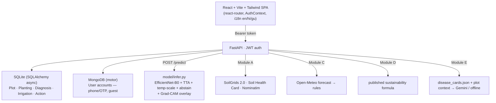

# AgriSmart AI

**Intelligent Agriculture for a Sustainable Future** — SIH 2026 internal hackathon (L. J. Institute, PS‑1 / C‑433).

A full smart‑agriculture app a farmer actually logs into: scan a leaf for a disease diagnosis,
save your fields, and get soil, weather, sustainability and plain‑language advice for each one.

```
Login ─▶ My Farm (map of plots) ─▶ Scan a leaf ─▶ Diagnosis + Grad‑CAM + what to do
                     │
                     ├─▶ Plot detail: soil profile · crop fit · amendments · activity timeline
                     ├─▶ Weather advice (rules over Open‑Meteo)
                     ├─▶ Sustainability score (published formula)
                     └─▶ Farm assistant (voice, grounded RAG, en/hi/gu)
```

---

## Modules built

| # | Module | Status | Where |
|---|---|---|---|
| **Core** | Crop‑disease detection (CV) — `predict(image)->label`, Grad‑CAM, abstention | ✅ | `model/`, `POST /predict` |
| **A** | Crop recommendation — **re‑imagined as GPS → real soil**: SoilGrids 2.0 + Soil Health Card → texture, pH, N‑P‑K → crop fit + amendments | ✅ | `app/backend/services/soil_*`, `routers/{soil,recommend}.py` |
| **C** | Weather Intelligence — 3‑day Open‑Meteo forecast → rule engine → farmer actions | ✅ | `services/weather.py`, `POST /weather/advice` |
| **D** | Sustainability Score — reproducible published formula + tips | ✅ | `services/sustainability.py`, `POST /sustainability/score` |
| **E** | GenAI Farmer Assistant — grounded RAG over a disease‑card corpus + live plot context; Gemini when a key is set, offline knowledge‑base answer otherwise; **voice in/out**, en/hi/gu | ✅ | `services/assistant.py`, `POST /assistant/ask` |
| — | Auth + per‑farmer data (plots, plantings, diagnoses, irrigation, actions, timeline) | ✅ | `app/backend/{auth,db}.py`, `models/orm.py`, `routers/*` |
| F / G | IoT / Agentic advisor | ✂️ not attempted | — |

### Database split

The plan PDF specified **MongoDB**. This build splits persistence in two: **user accounts**
(phone/OTP login, name, location, primary crop) live in **MongoDB**, matching the plan, and are
visible in MongoDB Compass; everything else — plots, plantings, diagnoses, irrigation, actions —
stays in **SQLite + SQLAlchemy (async)**, a single file with zero setup, so the farm-data side of
the system still runs from this README on any machine without standing up extra infrastructure.
The schema (`app/backend/models/orm.py`) is a portable superset of the plan's data model; accounts
are a plain Pydantic model over a hand-rolled `motor` repo (`app/backend/models/user.py`,
`app/backend/services/users.py`) rather than a full ODM — the same "a handful of functions is
enough" reasoning already used for JWT auth. Tests never require a real MongoDB server: they swap
in an in-memory `mongomock-motor` client (see `tests/conftest.py`).

---

## Running locally

**Prerequisites:** Python 3.10+, Node 18+, and a MongoDB server for accounts —
install MongoDB Community Server and let it run as a service, or
`docker run -p 27017:27017 mongo`. Defaults to `mongodb://localhost:27017`; not needed to run
the test suite. Two terminals, both from the repo root.

### TL;DR

```bash
# terminal 1 — backend (installs CPU PyTorch too; first run creates agrismart.db + uploads/)
pip install -r requirements.txt
python -m uvicorn app.backend.main:app --reload      # http://127.0.0.1:8000/docs

# terminal 2 — frontend
cd app/frontend
npm install
npm run dev                                           # http://localhost:5173
```

Open <http://localhost:5173>, enter a mobile number (or tap *Continue as guest*), verify with
the demo OTP shown on screen, add a plot on the map, and scan a leaf. The disease model is
**already trained** — its artifacts ship in `model/artifacts/` — so `/predict` works
immediately; re-run the training steps below only if you want to retrain.

### Terminal 1 — backend

```bash
pip install -r requirements.txt
python -m uvicorn app.backend.main:app --reload
```

- API + interactive Swagger docs: <http://127.0.0.1:8000/docs>
- First run creates `agrismart.db` (SQLite) and an `uploads/` folder next to the repo root —
  no external database or services to stand up.
- Config is optional — copy `.env.example` to `.env` to set a real `JWT_SECRET`, a
  `GEMINI_API_KEY` for the live assistant, etc. Every setting has a working default.
- PyTorch: `requirements.txt` pins CPU‑friendly minimums. If `pip` resolves a CUDA build you
  don't want: `pip install torch torchvision --index-url https://download.pytorch.org/whl/cpu`.

**Module E — enabling the live Gemini assistant.** Without a key, the assistant still answers
from the offline disease‑card knowledge base. To turn on live Gemini answers:
1. Get a free API key at [aistudio.google.com/apikey](https://aistudio.google.com/apikey)
   (sign in with a Google account → *Create API key*).
2. Copy `.env.example` to `.env` in the repo root, if you haven't already.
3. Set `AGRISMART_GEMINI_API_KEY=<your key>` in `.env` (and optionally
   `AGRISMART_GEMINI_MODEL` — defaults to `gemini-1.5-flash`).
4. Restart the backend. `.env` is git‑ignored — never commit a real key.

### Terminal 2 — frontend

```bash
cd app/frontend
npm install
npm run dev            # http://localhost:5173 — proxies /api and /uploads to :8000
```

Start the backend first; Vite's dev proxy forwards API calls to it, so no CORS setup is
needed locally. Register → add a plot on the map → scan a leaf → explore weather /
sustainability / assistant.

### (Optional) retrain the crop‑disease model

Only needed if you want to reproduce or redo training — trained weights are already committed.

```bash
python model/download_data.py --out data/plantvillage --per-class 160   # ~2.9k images, GitHub CC0
python model/train.py --data-dir data/plantvillage --epochs 4           # writes model/artifacts/
python model/predict.py --image data/samples/leaves/Tomato___Late_blight.jpg
#  -> Tomato___Late_blight
python model/evaluate.py --dir data/plantvillage --out report/model_report.md
```

`predict(image_path) -> class_label` is importable as `from model.predict import predict`.
Bundled sample leaves in `data/samples/leaves/` let you test without downloading anything.

### Tests

```bash
pytest -q                             # 47 tests: soil, auth, plots, predict, modules C/D/E
cd app/frontend && npm run build      # frontend type/build check
```

---

## Reported metrics (core)

`model/train.py` fine‑tunes **timm EfficientNet‑B0** (transfer learning, field‑simulation
augmentation, temperature scaling, TTA, low‑confidence abstention).

| | Macro‑F1 | Accuracy | Notes |
|---|---|---|---|
| Internal PlantVillage val (15% hold‑out) | **0.966** | 0.967 | lab‑condition images, same distribution as training |
| `evaluate.py` over the subset (≤35/class, 630 imgs) | **0.992** | 0.992 | sanity check via the predict interface; overlaps training data |

Full per‑class precision/recall + confusion matrix: [`report/model_report.md`](report/model_report.md).
**These are lab‑image numbers.** The challenge's difficulty is lab→field generalisation; the
organisers' held‑out field test set (scored via `model/predict.py`) is the real measure, and
the training augmentation + abstention target exactly that gap. Retrain on the official kickoff
label list when it ships — only the class folder names change.

---

## Architecture



All API routes live under `/api` (the SPA owns bare paths like `/weather`, `/soil`); uploaded
images and Grad‑CAM overlays are served from `/uploads`.

| Method | Endpoint | Auth | Purpose |
|---|---|---|---|
| `POST` | `/api/auth/otp/request`, `/api/auth/otp/verify`, `/api/auth/guest`, `/api/auth/complete-profile` | – | accounts (phone+OTP, guest, onboarding) |
| `GET` | `/api/auth/me` | ✅ | current account |
| `GET/POST/PATCH/DELETE` | `/api/plots`, `/api/plots/{id}` | ✅ | fields; create auto‑fetches soil |
| `GET` | `/api/plots/{id}/timeline` | ✅ | merged diagnoses + irrigation + actions |
| `POST` | `/api/plantings`, `/api/irrigation`, `/api/actions` | ✅ | crop + activity logs |
| `POST` | `/api/predict` (multipart image) | ✅ | disease diagnosis + Grad‑CAM, writes history |
| `GET` | `/api/diagnoses` | ✅ | scan history |
| `POST` | `/api/soil/lookup`, `/api/recommend/amendments`, `/api/recommend/crops` | – | Module A |
| `POST` | `/api/weather/advice`, `/api/sustainability/score`, `/api/assistant/ask` | – / – / opt | Modules C / D / E |

Module docs: [`docs/soil_sources.md`](docs/soil_sources.md) ·
[`docs/weather_rules.md`](docs/weather_rules.md) · [`docs/sustainability.md`](docs/sustainability.md).

---

## Frontend

React 19 + Vite 6 + Tailwind v4 (configured entirely in `src/index.css` via `@theme` — no
`tailwind.config.js`). `react-router-dom` for pages, a token `AuthContext`, a lightweight
`i18n` (English complete; Hindi + Gujarati for nav and key actions), utility‑class styling
with `clsx` for variants, shared `<Card>` surface. See
[`app/frontend/README.md`](app/frontend/README.md).

---

## Data sources & licences

| Source | Used for | Licence |
|---|---|---|
| **PlantVillage** (`spMohanty/PlantVillage-Dataset`) | training the disease classifier (18‑class subset) | CC0 |
| **SoilGrids 2.0** (ISRIC) | texture, pH, SOC, N, CEC, bulk density, WRB soil class | CC‑BY 4.0 — Poggio et al. 2021, *SOIL* 7, 217–240 |
| **Soil Health Card** (soilhealth.dac.gov.in) | district‑average available N/P/K | Govt. of India open data |
| **Open‑Meteo** | 3‑day weather forecast | free API, CC‑BY 4.0 |
| **Nominatim / OpenStreetMap** | reverse geocoding, map tiles | ODbL |
| **Google Gemini** (optional) | assistant answer generation when `AGRISMART_GEMINI_API_KEY` is set | Google API terms |
| rule tables (`data/*.json`) | crop / amendment / disease‑card thresholds | compiled from ICAR & State Ag‑Univ package‑of‑practices |

---

## Tech stack

**Backend** FastAPI · SQLAlchemy 2 (async, SQLite) · Motor (async MongoDB) · PyJWT · httpx · Pydantic v2
**ML** PyTorch · timm (EfficientNet‑B0) · torchvision · pytorch‑grad‑cam · scikit‑learn · Pillow
**Frontend** React 19 · Vite 6 · Tailwind CSS v4 · react‑router‑dom · react‑leaflet / Leaflet · clsx
**Assistant** google‑generativeai (optional) · Web Speech API

---

## Originality declaration

- All application, ML‑pipeline and frontend code is original work for this hackathon.
- Reused, unmodified, via public interfaces: **PlantVillage** images, **SoilGrids 2.0** REST
  API, **Soil Health Card** published averages, **Open‑Meteo**, **Nominatim / OpenStreetMap**,
  **timm** pretrained EfficientNet‑B0 (ImageNet), and the open‑source libraries above.
- No public notebook or solution was copied. AI coding assistants were used during development;
  the working system and its evaluation are what is submitted.

---

## Repository layout

```
app/backend/    FastAPI: auth, db (SQLite), mongo (accounts), models/{orm,user,auth,farm,modules,soil,recommend}, routers/, services/
app/frontend/   React SPA: pages/, components/, auth/, i18n/, lib/
model/          download_data · dataset · net · train · predict · evaluate · gradcam · infer · labels
data/           disease_cards.json · crop_suitability.json · soil_amendments.json · shc_reference/ · samples/
docs/           soil_sources · weather_rules · sustainability
report/         model_report.md (generated)
tests/          47 tests (pytest)
```
